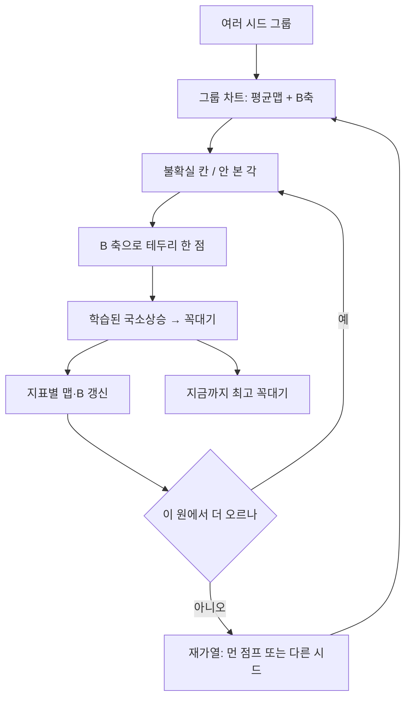

# antenna_simluation

픽셀 패치 안테나(FR4, 중심 약 7.25 GHz)를 voxel Yee FDTD로 평가하고, 구리 on/off 배치를 최적화한다. 점수는 실현이득 근사(지향성 대용 × 정합효율)를 **최대**화한다.

아래 **설계**는 토론으로 정리한 탐색 방식이다. **현재 코드**는 그 일부만 구현되어 있다. 둘을 섞어 읽지 말 것.

---

## 1. 두 공간을 섞지 말 것

최적화 변수는 판 위의 그림이 아니라 **배치 하나 전체**다.

| | 판(PEC) 공간 | 점수 산맥(PES) |
|---|---|---|
| 한 점 | 픽셀 \((i,j)\) | 마스크 하나 \(x\in\{0,1\}^{51\times 51}\) (급전 연결) |
| 좌표 | mm, 급전 (25,25) | 2601차원 이산 격자 |
| 높이 | 구리 두께가 아님. 전계 \(\lvert E\rvert\) 도 점수가 아님 | 적합도 \(f(x)\) |
| 사진 | `run_out` JPG의 구리·공기면 | 그릴 수 없음. 차트로만 내려다봄 |

**원**은 구리 실루엣의 동심원이 아니다. PEC를 두께 산으로 본 것도 아니다. 원은 **점수 산맥을 낮은 차원으로 눌러 본 뒤, 시드 주위 디스크**다. 판 사진 한 장은 산맥의 한 점일 뿐이다.

---

## 2. 압축: 산맥을 어떻게 내려다보나

\(2^{2601}\) 칸을 지도로 완성할 수 없다. 상관·규칙을 전제하고, **시드 주위만** 차트로 만든다. “몇 차 다항식인지”를 맞추는 압축이 아니다. 원 안에서 본 울퉁불퉁함이 **바로 바깥이 될 수 있는 모양의 집합을 줄이고**, 테두리의 한 조각을 더 재면 그 집합을 또 줄인다.

### 2.1 1차 압축 — 비슷한 파라미터 그룹

2601비트를 직접 군집하면 칸 몇 개 차이로 멀어져, 안테나로는 같은 종류가 갈라진다. 그룹 좌표는 작게 둔다.

마스크 \(x\)에 대해 대략

- \(N_{\mathrm{Cu}}(x)\): 구리 칸 수
- 고리 질량: 급전 기준 반지름 구간 \(r=0{\sim}25\)을 몇 고리로 나눠 각 고리 구리 비율
- 사분면 질량: 기존 대칭 모드와 같은 축(직교 4방 / x반사 등)
- \(r_{\mathrm{rms}}(x)\): 구리가 급전에서 얼마나 퍼졌는지

이 벡터가 가까운 마스크들이 **한 그룹**이다. 작은 패치, 중간 면적, 바깥이 두꺼운 형처럼 시작 시드 여러 개가 각 그룹의 첫 점이 된다. 전역을 노리므로 **밝히는 맵의 첫 지점은 시드를 여러 개** 둔다. 원 하나면 그 분지의 가능성만 줄어든다.

그룹 중심 \(c\)는 그 그룹 마스크의 평균 구리맵(칸별 점유 확률)이다. 이것이 그 원 차트의 원점이다.

### 2.2 2차 압축 — 그룹 안에서 주름의 축 (디퓨전 B)

중심 \(c\)에서 평가된 마스크를 잔차로 둔다.

\[
r^{(t)} = x^{(t)} - c
\]

점수(또는 예측 정확도)로 가중해 잔차 행렬을 만들고, 경제 SVD로 앞 \(k\)축만 남긴다. \(k\)는 작게(예: 8). 51×51이면 그대로 공분산은 약 \(2601^2\)이라 자손 수백 개로는 못 쓴다. **저랭크 PCA가 디퓨전 B**다.

- 1~2축: 이 그룹을 **위에서 내려다보는 땅의 가로·세로**. 점수 \(f\)가 높이. 원이 사는 평면.
- 나머지 축: 같은 땅의 **허용된 주름**. 멀리 떨어진 칸이 같이 켜지고 꺼지는 결합(예: 3시가 두꺼워질 때 9시도).

고유값으로 스케일한 거리(마할라노비스)로 시드에서 \(R\) 안을 **원(디스크)** 이라 부른다. 해밍 구면(칸을 제각각 뒤집기)이 아니다. 독립 뒤집기는 연결이 깨진 눈이 되고, B 타원체 위의 점만 “한 장의 안테나로 이어질 법한 주변부”다.

B는 지도의 평균 높이가 아니다. **평균에서 벗어날 때 칸이 묶여 움직인다**는 제약이다. 3×3 옆칸 번짐이 아니다. 3×3은 예전 국소 성장 커널이며 **이 설계의 필수 층이 아니다.** 격자 이웃은 국소상승·연결 수리에만 남긴다.

### 2.3 원 안에서 무엇을 쌓나 — 강화 맵

그룹마다 칸별 맵을 지표별로 둔다. `score`, `D_use`(지향성 대용), \(\eta\)(정합효율). 평가한 마스크를 예측 상관으로 가중해 쌓는다. 맵 \(p_{ij}\)는 “이 원에서 구리가 있을 법한 자리”, 즉 차트의 **중심 가설**이다.

애매한 칸(예: \(0.15 < p_{ij} < 0.85\))과, 차트에서 아직 안 본 각·반지름이 **다음에 밝힐 주변부**다. 자손은 판 전체 무작위 베르누이가 아니라 여기서만 만든다.

- 강화 맵으로 어느 칸이 불확실한지
- B 축으로 그 불확실성을 **한 장의 변형**으로 내보낼지

원 안을 밀도 있게 본 뒤에는, 애매함이 줄고 점수가 안 오르는 테두리만 판다. 지도 완성이 아니라 **가능성 집합을 자르는 일**이다. 잘리는 범위는 점수가 같이 움직이는 길이(해밍·B축 거리)만큼이다. 그 길이를 모르면 원을 실제보다 크게 안 것으로 착각한다.

### 2.4 이 압축이 보장하지 않는 것

상관 구조를 가정하면 극값 밀도·“더 높은 값이 남을지”를 모델상 말할 수는 있다(랜덤장 Kac–Rice, 국소최대 값의 EVT, 분지 미관측 종). **차원과 근처 극값만으로 그 확률은 정해지지 않는다.** \(n=2601\)은 국소 극값이 많다는 쪽이지, 전역을 닫지 않는다. 압축 차트는 전역 지도가 아니다.

---

## 3. 탐색 아이디어 (설계)

목표는 전역 최대에 **가까워지는 것**이지, 가까움을 증명하는 것이 아니다. 증명 가능한 거리 지표는 없다.

### 3.0 지금 돌리는 순서: 짧은 원 예열 → 진화

원을 크게 키워 지도를 완성하지 않는다. 중심 시드 주위를 **조금만** 밝히고, 그 디스크 안의 꼭대기 여러 개(최고 1마리가 아님)를 초기 집단으로 넘긴 뒤 **이전에 쓰던 멤에틱 GA**를 그대로 돌린다. 원 안 최고는 전역이 아니라 예열된 봉우리일 뿐이다.

반지름 \(r\) 은 모듈 `circle.schedule` 에서 고른다.

| `CIRCLE_R_MODE` | 동작 |
|---|---|
| `linear` | `step` 만큼 연속에 가깝게 증가 |
| `discrete` | `CIRCLE_RINGS` 에 적은 고리만 |
| `interval` | `interval, 2*interval, … ≤ r_max` (기본) |

예열은 짧게 (`CIRCLE_R_MAX` 작음, 시드·각 수 제한). 본탐색은 GA다. GA 자손도 평가될 때마다 맵·B가 갱신된다. 엘리트를 못 넘기면 그 배치로 넓힌 차트에서 원을 조금 더 파고, 추가탐색의 최고 꼭대기가 엘리트보다 높으면 세대를 갱신하고, 아니면 **집단에 넣어** 다음 변이에 쓴다.


### 3.1 시드

여러 시드 = 산맥 여러 곳에 원. 각 시드는 2.1의 그룹 좌표가 서로 떨어지게 고른다. 한 실행 안에서 그룹 맵·B는 유지하되, 시드가 다르면 원(차트)은 따로 밝힌다.

### 3.2 원 위에서 점 찍기

세대의 자손은 무작위 전판이 아니다.

1. 그룹 중심·강화 맵에서 불확실 칸을 고른다.
2. 디퓨전 B 축 한두 개를 타고 디스크 테두리로 한 걸음 나간다.
3. 급전 연결을 고친다.
4. **국소상승**으로 그 분지 꼭대기까지 올린다. 맵에는 거친 점이 아니라 꼭대기만 넣는다.

국소상승은 **학습**한다. 같은 종류의 언덕에서 어느 가장자리를 뒤집으면 오르는지가 반복되므로, 정책이 붙으면 FDTD 횟수가 줄어든다. 시드·재가열로 모양이 바뀌면 정책이 잠깐 빗나간다. 같은 분지에서는 빨라지고, 분지를 바꾸면 잠시 다시 비싸다.

내려갔다 뒤집기로 기울기를 재는 강화는 쓰지 않는다.

### 3.3 막히면 재가열

원 안에서 더 나은 꼭대기를 여러 번 못 내면 그 원을 닫는다. 그때 온도를 동의로 식히지 않는다. 세 방향이 같다고 식히면 같은 언덕에만 붙는다.

재가열은 **다른 시드 또는 B를 크게 키운 점프**다. 점프가 맵을 그대로 따르면 같은 원으로 돌아온다. 착지 뒤에만 오르막 정책을 써서 빨리 식힌다.

사이클을 몇 번 돈다. 재가열마다 의미 있는 경향은 오르막 화살표의 평균이 아니라 **도착한 꼭대기의 위치·점수**, 그리고 `(시작 종류, 점프 종류) → 도착 점수`다. 오르막은 각자 자기 봉우리를 가리킨다. 그 화살표로 전역을 계산하지 않는다.

시작점과 가열·냉각이 어느 분지로 떨어지는지는 맞다. 분자 어닐링처럼 스케줄 곡면을 학습할 샘플은 없다. 점프 종류 몇 가지를 실험으로 고르는 정도다.

### 3.4 역할 한 줄

- **시드 그룹**: 원들의 중심(전역 덮임)
- **강화 맵**: 원 안 평균 지형, 다음에 팔 애매한 칸
- **디퓨전 B**: 내려다보는 땅의 축 + 테두리의 허용 주름
- **국소상승(학습)**: 찍은 점을 봉우리로, 같은 원 안에서 점점 싸게
- **재가열**: 원이 막히면 다른 원
- **결과**: 모든 시드·재가열의 꼭대기 중 최고. 전역 증명 아님

정렬(GA 이동 · 맵 · B 1축 코사인)은 같은 분지를 읽는지의 로그다. 식히는 방아쇠가 아니다.

### 3.5 나중 본루프 (아직 미구현, 재가열)

예열+GA 다음 단계. 지금 실행 경로가 아님.



---

## 4. 이 방식이 유의미한가, 독창적인가

유의미하다. FDTD가 비싸고 차원이 큰 이산 안테나에, **전판 무작위 자손 대신 시드 원만 밝히고, 평균(맵)과 결합(B)과 국소꼭대기를 나눈 것**은 이 문제에 맞다. 전역을 노리면 시드를 여러 개 두는 것도 맞다.

독창적인 **새 알고리즘 부류**는 아니다. 조각은 이미 있다.

- 그룹 좌표 + 원: 표현형 군집, trust region, 능동학습
- 강화 맵: 교차 엔트로피 / 분포추정(CEM, EDA)
- 디퓨전 B: CMA-ES·NES와 같은 공분산·저랭크 변형
- 꼭대기만 기록 + 재가열: 멤에틱 GA, basin hopping, iterated local search
- 애매한 곳만 파기: 크리깅/GP 적응샘플의 이산 판

새로 보이는 지점은 “PEC를 위에서 본 원”을 **구리 모양이 아니라 점수 산맥의 차트 디스크**로 못 박고, 그 차트의 축을 B와 같은 것으로 쓴다는 해석이다. 연구로 쓰려면 “남들이 안 하던 연산자”가 아니라, **이 스택을 픽셀 PEC에 일관되게 붙인 공학**으로 쓰는 편이 정직하다. 전역 최적 증명이나 산맥 전체 복원은 주장하지 않는다.

따로 채팅·문서로 남길 가치는 있다. 구현 로그와 섞이면 원이 판의 동심원으로 다시 읽힌다. 이 README가 그 분리용이다.

---

## 5. 모듈

```
core.py              마스크, 연결, 시드, Individual
learn/maps.py        지표별 구리맵 (원의 중심 가설)
learn/diffuse_b.py   잔차 PCA (차트 축 · 테두리 주름)
learn/offspring.py   위 둘 + 레거시 3x3 을 GA 가 부르는 인터페이스
circle/schedule.py   r: linear / discrete / interval
circle/chart.py      차트 원 위 한 점 → 마스크
circle/warmup.py     짧은 예열 → GA 초기집단
opt_ga.py            국소상승, 평가, 멤에틱 GA
opt_rl.py            선택적 REINFORCE
main.py              설정만
```

`CIRCLE_WARMUP=True` (기본) 이면 `python main.py` 가 원 예열 후 GA. `False` 면 예전처럼 랜덤 초기집단.

---

## 6. 현재 코드 / 아직 만들 것

된 것:

- CUDA/CPU FDTD, openEMS 게이트, `gain` 적합도
- 멤에틱 GA (꼭대기만 엘리트, 배치 한도 중단)
- 맵·디퓨전 B·정렬 로그·온도 고정 — `learn/` 으로 분리
- **짧은 원 예열** + r 스케줄 3종 + 꼭대기 여럿을 GA에 전달
- GA 평가마다 맵·B 갱신. 엘리트 실패 시 원 추가탐 + 그 최고를 집단에 유지
- 맵 탐지 JPG: `run_out/Reveal_*.jpg`. 경우의 수 \(2^{2601}\). 큰 그림은 시드 옆 Hamming 원을 **확대**, 구석 미니맵은 전체 공간(초반 평가는 점 하나). 점선 원=지금 밝힌 디스크.

아직 만들 것:

1. **국소상승 정책 학습** — 지금 가장자리 탐은 그대로, 뒤집을 칸을 맵/B로 줄이는 정책. 같은 분지에서 FDTD를 줄이기.
2. **시드 그룹 좌표** — 고리·사분면·\(N_{\mathrm{Cu}}\) 로 원을 여러 개 열기. 지금은 시드 마스크만 여러 개.
3. **재가열** — 원이 막히거나 GA가 배치 한도에 걸리면 먼 점프/다른 시드. 지금은 중단.
4. **GA 자손에서 전판 랜덤 제거** — 예열 이후에도 `RANDOM_START` 가 남음. 불확실 칸 + B 축만.
5. **3×3 변이에서 빼기** — 설계상 필수 아님. `mutate` 에 아직 있음.
6. **원 예열: 예측된 안쪽 건너뛰기** — 고리마다 각을 전부 평가. mix로 건너뛰기는 없음.
7. **점프 종류 밴딧** — `(시작, 점프) → 도착 점수` 로 다음 재가열 고르기.

실행: `python main.py`. 출력 `run_out/`, 디버그 `run_byproduct/`.

환경: Windows · Python 3.14 · CUDA · `C:\openEMS` · numpy · matplotlib · CSXCAD/openEMS. native `voxel_fdtd.dll`(OpenMP), `voxel_fdtd_cuda.dll`(NVRTC).
