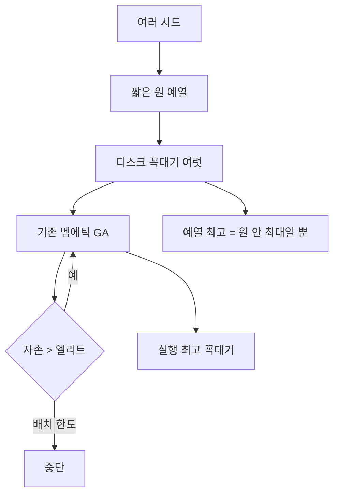
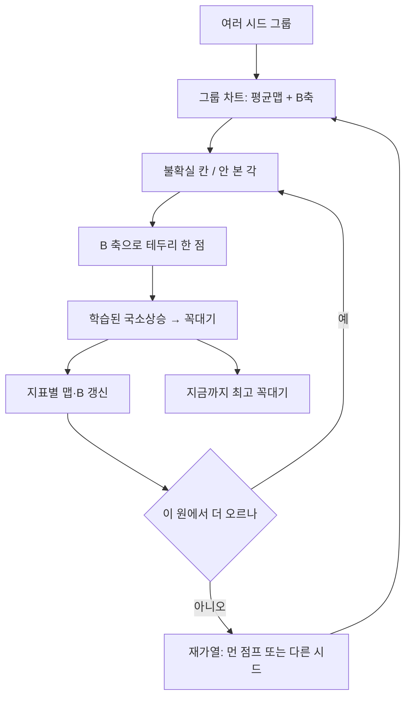

# antenna_simluation

픽셀 패치 · FR4 · ~7.25 GHz · voxel Yee FDTD · 구리 on/off · 점수 = 실현이득 근사 (D 대용 × η) **최대**

**설계** ≠ **현재 코드**. 섞어 읽지 말 것.

---

## 1. 두 공간 — 섞지 말 것

변수 = 판 그림이 아님. **마스크 하나 전체**.

| | 판(PEC) | 점수 산맥(PES) |
|---|---|---|
| 한 점 | 픽셀 \((i,j)\) | 마스크 \(x\in\{0,1\}^{51\times 51}\) (급전 연결) |
| 좌표 | mm · 급전 (25,25) | 2601차원 이산 |
| 높이 | 구리 두께 아님 · \(\lvert E\rvert\) 도 점수 아님 | \(f(x)\) |
| 사진 | `run_out` 구리·공기면 | 못 그림 · 차트만 |
| 경우의 수 | — | \(2^{2601}\) · 초반은 점조차 안 보임 · **확대** 필요 |

**원** ≠ 구리 실루엣 동심원 · ≠ PEC 두께 산  
원 = 산맥을 저차원으로 누른 **시드 주위 디스크**  
판 사진 1장 = 산맥의 점 1개

---

## 2. 압축

\(2^{2601}\) 완성 불가  
전제: 상관·규칙  
범위: 시드 주위만  
아님: 다항식 차수 맞추기  
함: 원 안 울퉁불퉁 → 바깥 가능 집합 축소 · 테두리 한 점 더 → 또 축소

### 2.1 1차 — 파라미터 그룹

2601비트 직접 군집 = 칸 몇 개에 갈라짐 · 안테나로는 같은 종  
그룹 좌표 작게:

- \(N_{\mathrm{Cu}}\) 구리 칸 수
- 고리 질량 급전 \(r=0{\sim}25\)
- 사분면 질량 직교4방 / x반사
- \(r_{\mathrm{rms}}\) 퍼짐

가까운 벡터 = 한 그룹  
시드 여러 개 = 그룹 첫 점 = 전역 덮임  
원 1개 = 그 분지만  
중심 \(c\) = 그룹 평균 구리맵 = 차트 원점

### 2.2 2차 — 디퓨전 B (주름 축)

\[
r^{(t)} = x^{(t)} - c
\]

잔차 · 점수/정확도 가중 · 경제 SVD · \(k\sim 8\)  
원 공분산 \(2601^2\) 불가 · **저랭크 PCA = B**

- 1~2축: 내려다보는 가로·세로 · 높이 \(f\) · 원이 사는 평면
- 나머지: 허용 주름 · 먼 칸 동시 on/off (3시↔9시)

원(디스크) = 마할라노비스 \(R\) 안  
≠ 해밍 구면(칸 제각각 뒤집기) · 그건 연결 깨진 눈  
B 타원체 위만 “한 장으로 이어질 주변부”

B ≠ 지도 평균 높이  
B = 평균에서 벗어날 때 **칸이 묶여 움직임**  
≠ 3×3 옆칸 번짐 · 3×3 = 옛 국소커널 · **설계 필수 아님**  
격자 이웃 = 국소상승·연결 수리만

### 2.3 강화 맵 — 원 안에 쌓는 것

지표별 칸 맵: `score` · `D_use` · \(\eta\)  
예측 상관 가중 적재  
\(p_{ij}\) = 이 원에서 구리 자리 · **중심 가설**

다음 주변부 = 애매 칸 \(0.15<p<0.85\) + 안 본 각·\(r\)  
자손 ≠ 전판 베르누이 · 여기만

- 맵 → 어느 칸이 불확실
- B → 그 불확실을 **한 장 변형**으로

밀도 본 뒤 = 애매↓ · 안 오르는 테두리만  
≠ 지도 완성 · = **가능 집합 절단**  
절단 길이 = 점수가 같이 움직이는 거리(해밍·B)  
그 길이 모르면 원을 과대평가

### 2.4 보장 안 함

상관 가정 시에만 극값 밀도·잔여 상방 모델 (Kac–Rice · EVT · 미관측 종)  
**차원 + 근처 극값 ≠ 그 확률**  
\(n=2601\) = 국소 극값 많음 · 전역 닫지 않음  
압축 차트 ≠ 전역 지도

---

## 3. 탐색 (설계)

목표: 전역에 **가까워짐** · 가까움 **증명 없음** · 거리 지표 없음

### 3.0 지금 실행: 짧은 원 예열 → 멤에틱 GA

원 키워 지도 완성 아님  
시드 주위 **짧게** → 디스크 꼭대기 **여러 개** → 기존 GA  
원 안 최고 ≠ 전역

`circle.schedule` · \(r\):

| `CIRCLE_R_MODE` | 동작 |
|---|---|
| `linear` | `step` 연속 증가 |
| `discrete` | `CIRCLE_RINGS` 만 |
| `interval` | `interval, 2×, … ≤ r_max` (기본) |

예열 짧게 · 본탐색 GA  
GA 평가마다 맵·B 갱신  
엘리트 실패 → 원 추가탐 → 그 max > 엘리트 면 세대 갱신 · 아니면 **집단에 유지**



### 3.1 시드

여러 시드 = 산맥 여러 곳 원  
그룹 좌표 서로 떨어지게  
맵·B는 실행 안 유지 · 시드 다르면 차트는 따로

### 3.2 원 위 점

자손 ≠ 전판 랜덤

1. 맵 불확실 칸
2. B 1~2축 · 테두리 한 걸음
3. 급전 연결 수리
4. **국소상승** → 꼭대기만 맵에

국소상승 **학습** · 같은 언덕 가장자리 반복 → FDTD↓  
시드·재가열로 모양 바뀌면 정책 빗나감 · 같은 분지 싸고 · 분지 바꾸면 잠깐 비쌈  
내려갔다 뒤집기 기울기 RL = 안 씀

### 3.3 막히면 재가열

여러 번 못 오르면 원 닫음  
세 방향 동의로 온도↓ = 안 함 · 같은 언덕에 붙음

재가열 = 다른 시드 **또는** B 큰 점프  
점프가 맵을 그대로 따르면 같은 원  
착지 후에만 오르막 정책

경향 ≠ 오르막 화살표 평균  
경향 = 도착 꼭대기 위치·점수 · `(시작, 점프) → 도착 점수`  
오르막 화살표로 전역 계산 안 함  
스케줄 곡면 학습 샘플 없음 · 점프 종류 밴딧 정도

### 3.4 역할

- 시드 그룹: 원 중심 · 전역 덮임
- 강화 맵: 원 안 평균 지형 · 다음에 팔 칸
- 디퓨전 B: 차트 축 · 테두리 주름
- 국소상승(학습): 점 → 봉우리 · 같은 원에서 점점 싸게
- 재가열: 원 막히면 다른 원
- 결과: 전 시드·재가열 꼭대기 중 최고 · 전역 증명 아님
- 정렬(GA·맵·B 코사인): 같은 분지 로그 · 식힘 방아쇠 아님

### 3.5 나중 본루프 (미구현)

예열+GA 다음 · 지금 경로 아님



---

## 4. 모듈

```
main.py                 설정만 · ALGORITHM / FITNESS / CIRCLE_*
core.py                 마스크 · 연결 · 시드 · Individual
learn/maps.py           지표별 CEM 맵 (score · D_use · η)
learn/diffuse_b.py      잔차 PCA · 차트 축 · ring_delta
learn/chart_log.py      평가 마스크·점수 · (u,v) 투영
learn/viz.py            Reveal JPG (확대 + 전체 미니맵)
learn/offspring.py      맵+B+레거시 3×3 · sample_rl / sample_diffuse_b
circle/schedule.py      r: linear / discrete / interval
circle/chart.py         차트 원 위 점 → 마스크 (B 있으면 ring_delta)
circle/warmup.py        예열 · probe_after_fail · inject_peak
opt_ga.py               국소상승 · 적합도 · 멤에틱 GA · LivePanel
opt_rl.py               선택 REINFORCE (ALGORITHM=rl / ga_rl)
solver_cpu.py           voxel_fdtd.dll OpenMP
solver_cuda.py          voxel_fdtd_cuda.dll · NVRTC PTX compute_75 → 드라이버 JIT
openems/gate.py         진화 전 메쉬 λ/10→40 · voxel vs openEMS
openems/sim.py          기준 openEMS
native/                 voxel_fdtd.cpp · voxel_fdtd_cuda.cpp · fdtd_kernels.cu
```

`CIRCLE_WARMUP=True` → `python main.py` = 예열 후 GA  
`False` → 랜덤 초기집단

---

## 5. 지금 코드 (기본값 `main.py`)

경로: 게이트 통과 → 원 예열 → 멤에틱 GA · 원 안 최고 ≠ 전역

| 키 | 값 |
|---|---|
| `FITNESS` | `gain` · \(D_{\mathrm{use}}=0.5\,D_{\mathrm{ap}}+0.5\,\mathrm{beam_{dB}}\) · \(\eta=1-\lvert S_{11}\rvert^2\) · `MIN_COPPER=80` |
| `BACKEND` | `cuda` |
| 집단 / 세대 | 8 / 10 · `MAX_OFFSPRING_BATCHES=40` · 이기면만 기록 |
| 예열 | `CIRCLE_SEEDS=3` · `interval` r=12,24 · 각 4 |
| 실패 시 | 원 테두리 `CIRCLE_FAIL_ANGLES=2` · max를 집단에 유지 |
| 자손 | GA + extra RL 5 + 디퓨전 B 5 · 각자 국소상승 8×4 |
| 학습 | 맵·B 매 평가 갱신 · T=1 고정 · 정렬=로그만 |
| 잔존 | `RANDOM_START=1.0` · `mutate` 3×3 (설계 층 아님) · 국소상승 정책 미학습 |

솔버: voxel 51×51 · CUDA 10.2 NVRTC `compute_75` · GPU sm_86 JIT  
게이트: openEMS 메쉬 수렴 후 voxel S11 비교 · 실패 시 진화 안 함

출력 `run_out/`:

- `Generation_***_Best.jpg` 구리 · 공기 |E| (선형 p2–max · 50% 초록 등고선) · S11
- `Reveal_w_s*_r***.jpg` 예열 · `Reveal_gen***.jpg` 세대 · `Reveal_final.jpg`
- Reveal = PES 차트 · **구리 사진 아님** · 큰 칸 = 시드 옆 Hamming 원 확대 · 구석 = \(2^{2601}\) 전체(초반 = 점 1)
- `score_history.csv`

디버그 `run_byproduct/metal/` npy+png · `log.csv`  
터미널: 평가마다 진행바 `[####] %  warmup|gen  eval n  seed/r/ang`

안 함: 내려갔다 뒤집기 · 세 방향 동의로 T↓ · 전역 거리 지표 · 3×3을 탐색 층으로 · 막히면 재가열(지금 = 배치 한도 **중단**)

아직:

1. 국소상승 정책 학습 — 가장자리 탐 유지 · 뒤집을 칸을 맵/B로 축소
2. 시드 그룹 좌표 — 고리·사분면·\(N_{\mathrm{Cu}}\) · 지금은 마스크만 여러 개
3. GA 전판 랜덤 제거 — 예열 후에도 `RANDOM_START` · 불확실 칸 + B만

실행: `python main.py`  
환경: Windows · Python 3.14 (3.11 설치 금지) · CUDA · `C:\openEMS` · numpy · matplotlib · CSXCAD/openEMS
