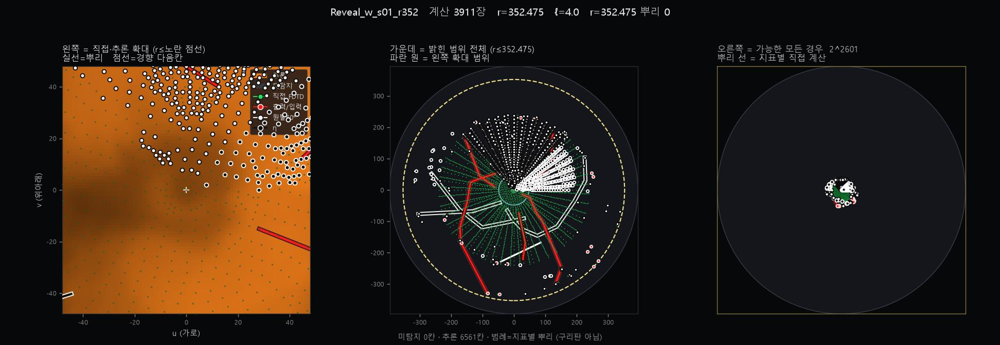
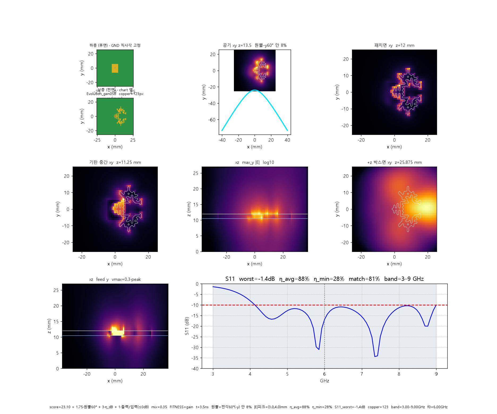

# 픽셀 안테나 자동 설계

51×51 mm 판 위의 어느 칸에 구리를 놓을지 정해서, 3~9 GHz(UWB)에서 반사가 적고 효율이 좋은 소형 안테나를 찾는 프로젝트입니다. 사람이 모양을 그리지 않고, 직접 만든 전자기 시뮬레이터(FDTD)로 계산하면서 탐색 알고리즘이 모양을 고릅니다.

칸 하나가 1 mm이고 칸마다 구리가 있거나 없으니까, 가능한 모양은 2의 2601제곱 가지입니다. 이걸 다 계산할 수는 없어서 일부만 직접 계산하고 나머지는 추론으로 메웁니다.

## 구조

- 기판은 FR4 (εr 4.4, tanδ 0.02), 두께 1.5 mm
- 아래층은 9×11.7 mm 사각형 구리로 고정
- 위층 51×51 칸만 바꾸고, 급전은 판 가운데에 50 Ω 포트로 넣습니다.
- 위층 구리는 항상 급전에 붙어 있어야 합니다. 떨어진 섬이나 모서리로만 닿은 칸은 계산 전에 잘라내서, 실제로 만들 수 없는 모양은 처음부터 제외합니다.

## 시뮬레이터

- C++로 직접 짠 Yee FDTD 솔버입니다. CPU(OpenMP)와 GPU(CUDA) 버전이 같은 결과를 냅니다.
- 반사(S11)는 50 Ω 포트의 복소 반사계수로 계산합니다.
- 근거리→원거리 변환(NTFF)을 넣어서 방사 패턴, 지향성, 총효율(복사전력/입사전력)까지 계산합니다.

### 검증

최적화를 시작하기 전에 공개 솔버 openEMS와 같은 기준 사각 패치를 비교합니다. openEMS는 메쉬를 λ/10부터 줄여가며 수렴을 먼저 확인합니다. 공진이 맞지 않으면 최적화를 시작하지 않습니다.

| 항목 | 자작 FDTD | openEMS | 차이 |
|---|---|---|---|
| 공진 주파수 | 6.96 GHz | 7.13 GHz | 2.4% |
| 최대 지향성 (6.5~7.5 GHz) | 5.9~6.5 dBi | 6.2~6.7 dBi | 0.8 dB 이내 |

## 탐색 과정

### 1. 워밍업

급전에서 구리가 뻗어 나가는 모양을 원 하나 위에 펼쳐 놓고 훑습니다. 원의 반지름은 급전에서 뻗어 나간 구리 칸 수, 각도는 뻗는 방향입니다.

- 원판 안쪽은 고리 모양으로 고르게 직접 계산합니다.
- 계산하지 않은 점은 가우시안 커널 대리모델로 점수를 추론하고, 그걸 보고 다음에 계산할 곳을 고릅니다. 대리모델은 라이브러리 없이 직접 구현했습니다.
- 원판 바깥은 효율, 지향성 같은 지표마다 일정한 경향이 보이는 점들을 이어 추세선을 만들고, 그 방향을 따라 탐색을 넓힙니다.



왼쪽은 급전 근처를 확대한 것입니다. 초록 점은 직접 계산한 곳이고 주황은 추론한 영역입니다. 가운데는 지금까지 탐색한 범위 전체와 지표별 추세선, 오른쪽은 2의 2601제곱 전체 중에서 탐색한 범위입니다.

### 2. 진화 알고리즘

워밍업에서 찾은 좋은 모양들에서 출발해 세대마다 모양을 섞고(교차) 바꿉니다(변이). 대리모델이 유망하다고 본 후보만 실제로 계산합니다.

### 점수

- 정합 효율: 3~9 GHz 평균 1−|S11|²
- 대역: S11이 −10 dB 아래인 주파수 비율
- 총효율: 복사된 전력 / 들어간 전력 (반사와 FR4 손실 포함)
- 지향성: 원거리 방사 패턴에서 한 방향 전각 60° 원뿔 안에 들어가는 전력 비율

## 실행 방법

Windows 기준입니다. MinGW g++와 CUDA Toolkit, Python, openEMS가 필요합니다.

먼저 솔버를 빌드합니다. CPU 버전과 GPU 버전 둘 다 만듭니다.

```
cd native
powershell -ExecutionPolicy Bypass -File .\compile.ps1
powershell -ExecutionPolicy Bypass -File .\compile_cuda.ps1
cd ..
```

빌드가 끝나면 실행합니다.

```
python main.py
```

openEMS 검증부터 워밍업, 진화까지 순서대로 돌고, 그림은 `run_out/`에 저장됩니다. GPU가 없으면 `main.py`의 `BACKEND`를 `"cpu"`로 바꾸면 됩니다.

## 결과



왼쪽 위가 최종 구리 모양이고, 나머지는 높이별 전기장 분포와 S11입니다.

| 항목 | 값 |
|---|---|
| 진화 | 50세대 |
| 구리 | 123칸 |
| S11 −10 dB 아래 | 약 4.2~9.0 GHz (대역의 81%) |
| 3~9 GHz 평균 정합 효율 | 88% |

모든 값은 자작 FDTD로 계산한 시뮬레이션 결과입니다. 금속 손실은 넣지 않았고, 실측은 아직 없습니다.

## 폴더

| 위치 | 내용 |
|---|---|
| `main.py` | 설정과 실행 시작점 |
| `native/` | C++ FDTD (CPU), CUDA 호스트 코드, GPU 커널 |
| `solver_cpu.py`, `solver_cuda.py` | FDTD를 파이썬에서 부르는 래퍼 |
| `ntff.py` | 원거리장 변환, 방사 패턴, 지향성 |
| `circle/` | 워밍업 탐색 |
| `learn/` | 대리모델, 자손 생성, 탐색 지도 그림 |
| `opt_ga.py` | 진화 알고리즘, 점수, 결과 그림 |
| `openems/` | openEMS 비교 검증 |
